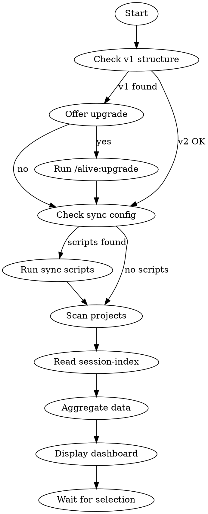

# alive:daily

Morning entry point. Surface what matters across ALL projects. The heartbeat of the learning loop.

## UI Treatment

Uses the **ALIVE Shell** — one rounded box, three zones (header / content / footer).

```
╭──────────────────────────────────────────────────────────╮
│  ALIVE · daily                            [date]         │
│  [aggregate stats]                                       │
│  ──────────────────────────────────────────────────────  │
│  [THE ANSWER — AI-recommended focus with * marker]       │
│  [THE MAP — entity grid]                                 │
│  ──────────────────────────────────────────────────────  │
│  [ACTIONS — paired with context stats]                   │
│  [FINE PRINT — * explanation, sparkline]                 │
╰──────────────────────────────────────────────────────────╯
```

**Rules:**
- `╭╮╰╯` rounded corners — outer frame only
- NO double-line borders (`╔╗╚╝`), NO internal boxes
- Two thin `──────────` lines separate zones
- `*` on AI-generated focus recommendation (explained in fine print)
- `)` on every selectable option
- `·` as delimiter in stats
- Lowercase section labels (ventures, experiments, life)
- `●○` five-day activity dots
- `!` attention indicator (urgent tasks or stale >14 days)

---

## Version Check (Before Main Flow)

Compare your `plugin_version` (from frontmatter above) against the user's system:

1. Read `{alive-root}/.claude/alive.local.yaml` → get `system_version`
2. If `system_version` is missing or different from your `plugin_version`:
   ```
   [!] System update available (plugin: 2.1.0, system: X.X.X)
       └─ Run /alive:upgrade to sync
   ```
3. Continue with skill — this is non-blocking, just a notice

---

## Overview

Daily aggregates context from every project and the session index to show:
- Goals from each project's status.md
- Ongoing threads from session-index.jsonl (with quality ratings)
- Urgent tasks across all projects
- Working files in progress
- Inputs pending triage
- Stale projects needing attention

**Different from `/alive:work`:** Daily shows EVERYTHING. Do focuses on ONE project.

## V1 Detection (REQUIRED FIRST STEP)

Before anything else, check for v1 structure:

```
Check: Does inbox/ exist? (should be 03_Inputs/)
Check: Does any _state/ exist? (should be _brain/)
```

If v1 detected:
```
[!] Detected ALIVE v1 structure

Your system uses the older v1 format. Upgrade to v2?
[1] Yes, upgrade now
[2] No, continue with v1
```

If yes → invoke `/alive:upgrade` then restart daily.

## Data Sources

| Source | Extract |
|--------|---------|
| `alive.local.yaml` | Sync script configuration (optional) |
| `.claude/state/session-index.jsonl` | Ongoing threads with quality tags |
| `{project}/_brain/status.md` | Goal line, phase, focus |
| `{project}/_brain/tasks.md` | @urgent tagged items |
| `{project}/_brain/manifest.json` | working_files array |
| `03_Inputs/` | Count of pending items |

## Flow



## External Sync (Optional)

**Power users can configure sync scripts** via `/alive:scan` or manually.

Check for `alive.local.yaml` at ALIVE root:

```yaml
# alive.local.yaml
sync:
  slack: .claude/scripts/slack-sync.mjs
  gmail: .claude/scripts/gmail-sync.mjs
```

**If sync sources are configured:**

```
▸ checking alive.local.yaml for sync scripts...
  └─ Found: slack, gmail

▸ running sync scripts...
  └─ slack-sync.mjs... ✓ 3 new items
  └─ gmail-sync.mjs... ✓ 1 new item

4 new items added to 03_Inputs/
```

**If no config or no sync section:**
```
▸ checking alive.local.yaml...
  └─ No sync scripts configured
```

Skip to project scanning.

**Script requirements:**
- Scripts should output to `03_Inputs/`
- Scripts should be idempotent (safe to run multiple times)
- Scripts should return exit code 0 on success
- Output format: one line per item added (for counting)

## Reference Output

The full daily output in vibrant format:

```
╭──────────────────────────────────────────────────────────╮
│                                                          │
│  ALIVE · daily                            2026-02-09     │
│                                                          │
│  ──────────────────────────────────────────────────────  │
│                                                          │
│  acme-agency — Client portal deployment due Wednesday *  │
│  Also requiring attention: side-project, health          │
│                                                          │
│                                      5 days  tasks       │
│  ventures                                                │
│   1) acme-agency        Building     ○●●●○     9    !    │
│   2) freelance-dev      Growing      ○○○●○     2         │
│   3) side-project       Pre-Launch   ○○○○○     4    !    │
│                                                          │
│  experiments                                             │
│   4) newsletter         Building     ○○●●○     6    !    │
│   5) saas-idea          Starting     ○●○●○     3         │
│   6) course-platform    Planning     ○○○○○     1         │
│                                                          │
│  life                                                    │
│   7) health             Active       ○○●○○     3    !    │
│   8) finance            Active       ○○○○○     1         │
│                                                          │
│  ──────────────────────────────────────────────────────  │
│                                                          │
│  #) pick an entity         d) digest 3 inputs            │
│  s) sweep 2 stale          r) search across system       │
│                                                          │
│  * suggested focus                                       │
│  ▁▂▃▅▇█▇▅▃▁▁▂▅▇█▇▅▃▂▁                   4-day streak   │
│                                                          │
╰──────────────────────────────────────────────────────────╯
```

## Numbered Actions (REQUIRED)

Every actionable item gets `)` to indicate selectability. User picks a number to focus.

When user picks:
- Entity number → `/alive:work` with that project
- `d)` → `/alive:digest`
- `s)` → `/alive:sweep`
- `r)` → `/alive:recall`
- `#)` → pick an entity by number

## Section: Goals

Extract from each `_brain/status.md`:
- Look for `**Goal:**` line
- Or `**Focus:**` line
- Or first sentence after `## Current Focus`

Show project name + goal. Max 5, sorted by recency.

Goals appear as part of each entity row in the grid — extracted from `status.md` goal line. The Answer zone surfaces the most urgent one as the AI-recommended focus.

## Section: Ongoing Threads

Read `.claude/state/session-index.jsonl`:
- Filter: `status: "ongoing"` only
- Sort: Most recent first
- Show: Project, summary, quality tag, relative time
- Max 5

Quality tags: `[routine]` `[productive]` `[important]` `[breakthrough]`

Ongoing threads inform the AI-recommended focus in The Answer zone. If a thread is ongoing from yesterday, it becomes the suggested focus. If no ongoing threads, the recommendation falls back to the entity with the most urgent tasks or open work.

## Section: Urgent Tasks

Scan all `_brain/tasks.md` files:
- Filter: Lines containing `@urgent`
- Prefix with project name
- Max 5

Urgent tasks trigger the `!` attention indicator on their entity row in the grid. The most urgent surfaces in The Answer zone.

## Section: Working Files

Scan all `_brain/manifest.json` files:
- Look for `working_files` array
- Show path + age
- Max 5

Working files count appears in the fine print stats. Individual working files are surfaced in `/alive:work` when focused on a single project.

## Section: Inputs

Check `03_Inputs/` folder:
- Count files/folders (not counting .DS_Store)
- Flag if count > 0
- Flag if no captures in 3+ days

Input count appears in the action bar: `d) digest 3 inputs`. If zero inputs, the `d)` action line disappears.

## Section: Stale Projects

Check each project's `_brain/manifest.json` for `updated` date:
- Flag if > 7 days (configurable)
- Show as numbered option

Stale entities get the `!` attention indicator in the grid. Count appears in the action bar: `s) sweep 2 stale`. If zero stale, the `s)` action line disappears.

## Freshness Flags

| Age | Flag | Meaning |
|-----|------|---------|
| < 7 days | (none) | Fresh |
| 7-14 days | `[!]` | Getting stale |
| > 14 days | `[!!]` | Needs attention |

## Edge Cases

**No ALIVE structure:**
```
[?] No ALIVE structure detected.
Run /alive:onboarding to set up.
```

**Empty system (structure exists but no projects):**
```
Your ALIVE system is empty. Let's get started.
[1] Create first venture
[2] Create first experiment
[3] Capture some context
```

## The Learning Loop

Daily is the START:

```
DAILY ────► WORK ────► SAVE ────► (repeat)
```

After showing dashboard, remind:
- Pick a number to focus → loads that project via `/alive:work`
- When done → `/alive:save` to preserve context
- Tomorrow → back to `/alive:daily`

## Related Skills

- `/alive:work` — Focus on one project
- `/alive:revive` — Resume past session
- `/alive:digest` — Process inputs
- `/alive:save` — End session

