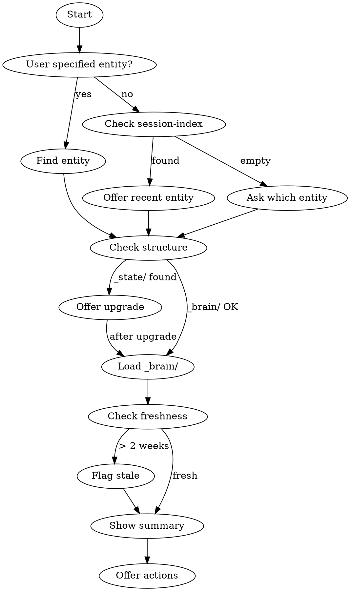

# alive:do

Focus on ONE entity. Load context from its `_brain/` folder and show current state.

**Different from `/alive:daily`:** Do focuses on ONE entity. Daily shows EVERYTHING.

## Flow



## Step 1: Identify Entity

**User specifies entity:**
```
"work on acme" → ventures/acme/
"focus on health" → life/health/
```

**User says "continue" or "resume" (no entity):**
1. Read `.claude/state/session-index.jsonl`
2. Find most recent `status: "ongoing"` entry
3. Offer that entity:
```
▸ checking session-index...
  └─ Last session: ventures/alive-llc (yesterday, [breakthrough])

Continue with alive-llc?
[1] Yes
[2] Pick different entity
```

**No session-index or no ongoing threads:**
```
No recent session found.

Which entity?
[1] ventures/supernormal
[2] ventures/alive-llc
[3] experiments/cricket-grid
```

**Multiple matches:**
```
"work on beta" matches:
[1] ventures/beta
[2] experiments/beta-test

Which one?
```

## Step 2: Check Structure (v1 Detection)

Before loading, check if entity uses v1 structure:

```
Check: Does {entity}/_state/ exist? (should be _brain/)
```

If v1 detected:
```
[!] ventures/acme uses v1 structure (_state/)

Upgrade to v2?
[1] Yes, upgrade now
[2] No, continue with v1
```

If yes → invoke `/alive:upgrade` with this entity, then continue.
If no → use `_state/` paths for this session.

## Step 3: Load Context

Read in order:
1. `{entity}/_brain/status.md` — Phase and focus
2. `{entity}/_brain/tasks.md` — Work queue
3. `{entity}/_brain/manifest.json` — Structure map

Show retrieval paths:
```
▸ reading ventures/acme/_brain/status.md
  └─ Phase: Building (updated 2 days ago)

▸ reading ventures/acme/_brain/tasks.md
  └─ 7 tasks, 2 @urgent
```

## Step 4: Check Freshness

Check `updated` date in manifest.json or file timestamps:

| Age | Action |
|-----|--------|
| < 2 weeks | Proceed normally |
| 2-4 weeks | Flag: `[!] Status is X days old. Still accurate?` |
| > 4 weeks | Warn + ask: `[!!] Status is very stale. Update before working?` |

```
[!] ventures/acme/_brain/status.md is 3 weeks old
    └─ Still accurate? [y] continue  [u] update first
```

## Step 5: Show Summary

```
╭─ ALIVE ────────────────────────────────────────────────────────────────╮
│  do • ventures/acme                                                    │
╰────────────────────────────────────────────────────────────────────────╯

▸ loaded context

STATUS
Phase: Building
Focus: Landing page launch by Friday

TASKS (7 total)
@urgent:
- [ ] Finalize pricing page
- [ ] Fix payment webhook

To Do:
- [ ] Write launch email
- [ ] Update docs
```

## Step 6: Offer Actions

Every actionable item gets a number:

```
─────────────────────────────────────────────────────────────────────────
[1] Finalize pricing page @urgent
[2] Fix payment webhook @urgent
[3] Write launch email
[c] View changelog
[s] Save when done

What's first?
```

## Edge Cases

**Entity doesn't exist:**
```
✗ ventures/acme/ not found

[1] Create ventures/acme/ (→ /alive:new)
[2] Show available entities
```

**No _brain/ or _state/ folder:**
```
[!] ventures/acme/ exists but has no context folder

Initialize _brain/ now?
[1] Yes, initialize
[2] Cancel
```

## After Loading

- Stay scoped to this entity (don't read other entities)
- Track changes for session
- When done → `/alive:save`

## Related Skills

- `/alive:daily` — See ALL entities
- `/alive:save` — End session
- `/alive:new` — Create entity
- `/alive:upgrade` — Migrate v1 → v2
