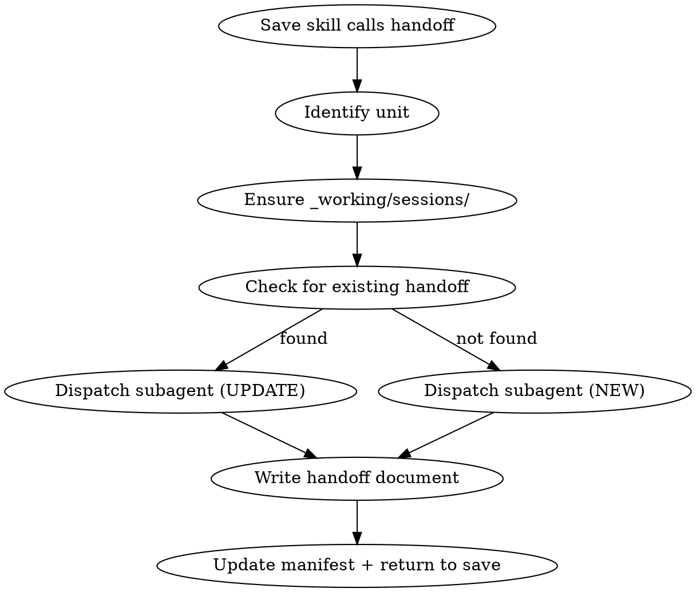

# alive:handoff

Create a comprehensive handoff document that enables a zero-context future session to pick up exactly where this session left off.

**Core principle:** The next Claude instance has NO memory. This document IS their memory.

## UI Treatment

Uses the **ALIVE Shell** — Tier 3: Utility.

```
╭──────────────────────────────────────────────────────────╮
│  ALIVE · handoff                        [session-id]      │
│  ──────────────────────────────────────────────────────── │
│  [Handoff document created]                               │
│  ──────────────────────────────────────────────────────── │
│  [✓ saved to _working/sessions/]                          │
╰──────────────────────────────────────────────────────────╯
```

See `rules/ui-standards.md` for shell format, logo assets, and tier specifications.

---

## When This Runs

Called by `/alive:save` when save reason is:
- "compact" / "context full" / "running out of space"
- "coming back later" / "will resume" / "continue tomorrow"

**Not user-invocable directly** — triggered through save flow.

## Flow



## Step 1: Identify Unit

Determine which unit this handoff belongs to from the current working directory and session context.

```
▸ creating handoff for 04_Ventures/acme/
```

## Step 2: Ensure Sessions Folder

Ensure `{unit}/_working/sessions/` exists. Create with `mkdir -p` if missing.

## Step 3: Check for Existing Handoff (Same Session)

**Before creating a new handoff, check if one already exists for this session ID.**

Check TWO locations (since handoffs are archived immediately on resume):

1. `manifest.handoffs[]` — for pending handoffs not yet resumed
2. `01_Archive/{unit-path}/sessions/` — for previously resumed handoffs

**If handoff found (either location):**

1. Read the existing handoff content
2. If found in archive, copy back to `_working/sessions/`
3. Dispatch subagent with **UPDATE** instructions (Step 4)
4. Update `updated` timestamp and increment `update_count` in frontmatter
5. Ensure entry exists in `manifest.handoffs[]`

This creates a **cumulative handoff** — each compaction appends to the same document rather than creating a new one.

**If no existing handoff:** Continue to Step 4 for a new handoff.

## Step 4: Extract Raw Material (Main Context)

**You are running in the main context with full conversation access.** This is the only place that can see what happened. Your job: extract structured raw material that a subagent will compose into the handoff document.

Go through the ENTIRE conversation and extract the following. Be exhaustive and specific — everything you miss is lost forever.

```
▸ analysing conversation...
  └─ Extracting what happened, why, and what comes next
```

### 1. What Happened

Extract a complete account of the session:

- **Session narrative** — What was the goal? What was attempted, in what order? Tell the chronological story from start to current state.
- **Problems solved** — Every problem encountered during the session. For each: what went wrong, what was tried, what ultimately fixed it. Include exact error messages, stack traces, or failure modes.
- **Files modified** — Every file created, edited, or deleted. For each:
  - Full absolute file path
  - What specifically changed (sections added/removed, functions modified, lines changed)
  - Why it changed (what drove the modification)
  - Before/after if the change is non-obvious
- **Code and working patterns** — Any significant code written, architectural patterns established, templates created, or conventions adopted. Include critical snippets verbatim if they'd be hard to reconstruct.
- **Dead ends** — Things that were tried and did NOT work. For each: what was attempted, why it failed, and why the next session should NOT try it again. These prevent wasted effort.

### 2. Why

Extract every piece of reasoning and decision-making:

- **Decisions made** — Every decision, no matter how small. For each:
  - What was decided
  - The full rationale (why this approach, not another)
  - What alternatives were considered and explicitly rejected
  - Who drove the decision (user direction vs agent recommendation)
  - Any conditions or caveats attached
- **Constraints discovered** — Technical limitations, API quirks, permission issues, system behaviours, performance boundaries — anything that constrains future work.
- **User preferences expressed** — Any time the user indicated how they want things done: workflow preferences, naming conventions, communication style, tool choices, priorities. These are gold for the next session.
- **Pivots and direction changes** — Moments where the plan changed mid-session. What was the original plan? What triggered the change? What's the new direction?
- **Principles established** — Rules, conventions, or agreements made during the session that should carry forward. "We decided to always X" or "Never do Y because Z."

### 3. What Comes Next

Extract everything needed for seamless continuation:

- **Exact next steps** — Numbered, specific, actionable, in priority order. Not "finish the feature" but "implement the validation logic in `/path/to/file.ts` starting at the `handleSubmit` function, following the pattern established in `handleCreate`." Each step should be doable without further clarification.
- **Breadcrumbs** — Documents created or significantly modified this session that the next session MUST read before doing anything. For each:
  - Full absolute file path
  - What the document is and why it matters
  - What to look for when reading it
  - Reading order (which file first, second, etc.)
- **Unfinished work** — Anything partially done. Exactly where it was left off. What remains. How far along it is (20%? 80%?).
- **Gotchas and warnings** — Edge cases discovered, things that look right but aren't, traps the next session might fall into, assumptions that seem obvious but aren't.
- **Dependencies** — What depends on what. What must happen before other things can start. Cross-references to other files, systems, people, or external services.
- **Context that exists nowhere else** — Important information that isn't captured in any file. Verbal agreements from the user, implicit understandings, "oh by the way" moments, context from the user's tone or intent that wouldn't be obvious from reading files alone.

## Step 5: Dispatch Subagent to Compose Document

**Pass all extracted raw material to a foreground subagent** (Task tool, NOT `run_in_background`) to compose and write the final handoff document. This keeps the main context lean while producing a thorough document.

### Subagent Prompt

```
You are composing a handoff document from pre-extracted session data.

CONTEXT:
- Session ID: {session_id}
- Unit: {unit_path}
- Reason: {continuing/coming_back_later}

RAW MATERIAL (extracted by main context from full conversation):

## What Happened
{paste extracted section 1}

## Why
{paste extracted section 2}

## What Comes Next
{paste extracted section 3}

{IF CUMULATIVE: "EXISTING HANDOFF CONTENT:\n{existing content}\n\nThis is update #{update_count + 1}. Preserve ALL existing content. Append new material as '## Update {N}' at the end. Do not duplicate or condense previous content."}

YOUR TASK:
Compose a handoff document using the template below. The raw material above contains everything — your job is to organise it clearly, not to invent or summarise. Every detail from the raw material must appear in the final document. **be exhaustive - include as much as possible**

QUALITY GATE: Before finishing, verify — "If a fresh Claude instance read ONLY this document, would it know EXACTLY what to do?" If no, add more detail.

DOCUMENT TEMPLATE: **ensure that every field of this template is followed and filled out**
Filename format: {description}-{session_id}-{date}.md
Write to: {unit}/_working/sessions/{filename}.md

---
created: {date}
session_id: {session_id}
unit: {unit_path}
status: pending
reason: {continuing/coming_back_later}
update_count: 0
---

> **ARCHIVE IMMEDIATELY AFTER READING.**
> Move this file to `01_Archive/{unit-path}/sessions/` and remove from
> `manifest.handoffs[]`. Do not proceed with any work until archived.

> **BREADCRUMBS — Read these before proceeding:**
> 1. `path/to/key-file.md` — What it is and why to read it
> 2. `path/to/created-doc.md` — What to look for
>
> *(Key documents from this session. Read in order before starting work.)*

# Session Handoff: {Brief Description}

## What You Need to Know

[1-2 paragraph summary — the essential context for someone with zero memory]

---

## What Happened

[Session narrative, problems solved, files modified with full paths and what changed, code patterns, dead ends that should not be repeated]

## Why

[Every decision with rationale and rejected alternatives, constraints discovered, user preferences expressed, pivots and what triggered them, principles established]

## What Comes Next

[Exact numbered next steps, unfinished work and its state, gotchas and warnings, dependencies, context that exists nowhere else]

---

## Updates (if cumulative)

### Update {N}: {date}

**Progress since last compaction:**
- What was completed
- What changed

**New decisions:**
- Decision and rationale

**Updated next steps:**
1. New priorities reflecting current state

MANIFEST UPDATE (BATCH — one Read, one Write):
After writing the document, update {unit}/_brain/manifest.json in a SINGLE operation:

1. Read the ENTIRE manifest.json with the Read tool
2. Make ALL of the following changes in the JSON before writing:
   - Set root "updated" to today's date (YYYY-MM-DD)
   - Append {session_id} to root "session_ids" array (if not already present — append, never overwrite)
   - Add or update handoff entry in the "handoffs" array (see below)
3. Write the COMPLETE modified JSON back with one Write call

Do NOT use multiple Edit calls. One Read → modify everything → one Write.

Handoff entry for NEW handoffs:
{
  "path": "_working/sessions/{filename}.md",
  "created": "YYYY-MM-DD",
  "session_id": "{session_id}",
  "status": "pending",
  "description": "One-line summary of what was in progress"
}

For CUMULATIVE handoffs (updating existing), find the entry matching this session_id and update:
- "description" — refresh to reflect current state
- Do NOT change "created" or "session_id"
```

```
▸ dispatching subagent to compose handoff...
  └─ Writing to _working/sessions/
  └─ This may take a moment...
```

## Step 6: Return to Save

The subagent handles the document write, manifest update, and session_ids — all instructions are in its prompt. Once it completes, **return control to the save skill immediately.**

```
✓ Handoff complete — returning to save flow
```
