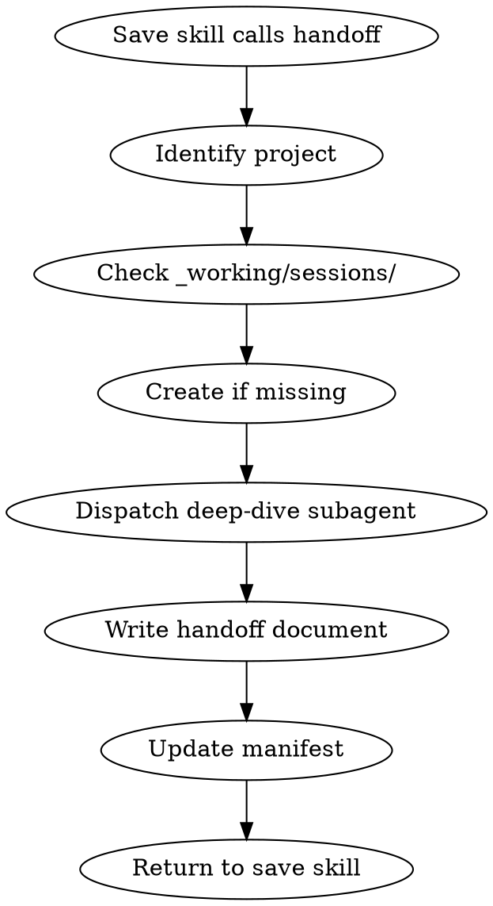

# alive:handoff

Create a comprehensive handoff document that enables a zero-context future session to pick up exactly where this session left off.

**Core principle:** The next Claude instance has NO memory. This document IS their memory.

## UI Treatment

This skill uses **Tier 3: Utility** formatting.

**Visual elements:**
- Compact logo (4-line ASCII art header)
- Double-line border wrap (entire response)
- Version footer: `ALIVE v3.0.1` (right-aligned)

See `rules/ui-standards.md` for exact border characters, logo assets, and formatting specifications.

---

## When This Runs

Called by `/alive:save` when save reason is:
- "compact" / "context full" / "running out of space"
- "coming back later" / "will resume" / "continue tomorrow"

**Not user-invocable directly** — triggered through save flow.

## Flow



## Step 1: Identify Project

Determine which project this handoff belongs to based on:
- Current working directory
- What was being worked on in the session

```
▸ creating handoff for 04_Ventures/acme/
```

## Step 2: Ensure Sessions Folder Exists

Check for `{project}/_working/sessions/` folder:

```bash
# If missing, create it
mkdir -p {project}/_working/sessions/
```

```
▸ checking _working/sessions/
  └─ [exists] ready
  └─ OR [created] _working/sessions/
```

## Step 2.5: Check for Existing Handoff (Same Session)

**Before creating a new handoff, check if one already exists for this session ID.**

Check TWO locations (since handoffs are archived immediately on resume):

1. `manifest.handoffs[]` — for pending handoffs not yet resumed
2. `01_Archive/{project-path}/sessions/` — for previously resumed handoffs

```
▸ checking for existing handoff...
  └─ Session ID: {current_session_id}
  └─ Checking manifest.handoffs[]...
  └─ Checking archive...
```

**If handoff found (either location):**
```
[!] Found existing handoff for this session:
    └─ {existing_handoff_path}
    └─ Created: {timestamp}
    └─ Source: [manifest | archive]

Retrieving and updating existing handoff...
```

**If found in archive:**
1. Read the archived handoff content
2. Copy back to `_working/sessions/` for updating
3. Dispatch subagent with UPDATE instructions
4. Save updated version to `_working/sessions/`
5. Add back to `manifest.handoffs[]`

This creates a **cumulative handoff** — each compaction appends to the same document.

→ Skip to Step 3, but **UPDATE** the existing file instead of creating new:
- Read the existing handoff (from archive or manifest location)
- Dispatch subagent with instruction to UPDATE/APPEND
- Preserve original context, add new progress
- Update the `updated` timestamp in frontmatter
- Increment `update_count` in frontmatter

**If no existing handoff for this session:**
```
▸ checking for existing handoff...
  └─ None found for session {session_id}
  └─ Creating new handoff
```

→ Continue to Step 3 normally.

## Step 3: Dispatch Deep-Dive Subagent (MANDATORY)

**This is the critical step.** Dispatch a subagent to analyse the ENTIRE conversation and extract everything needed for continuity.

### Subagent Prompt Template

**For NEW handoff:**
```
You are creating a handoff document for session continuity.

CONTEXT:
- Session ID: {session_id}
- Project: {entity_path}
- Reason for handoff: {compact/resuming later}

YOUR TASK:
Analyse this entire conversation and create a comprehensive handoff document.
```

**For UPDATING existing handoff (cumulative):**
```
You are UPDATING an existing handoff document for session continuity.

This is a CUMULATIVE handoff — the session has compacted multiple times.
Each update builds on previous context. The goal is ONE comprehensive document.

CONTEXT:
- Session ID: {session_id}
- Project: {entity_path}
- Reason for handoff: {compact/resuming later}
- Update number: {update_count + 1}
- Retrieved from: {archive | manifest}

EXISTING HANDOFF CONTENT:
{paste existing handoff content here}

YOUR TASK:
Update the existing handoff with progress made since the last save.

DO:
- Preserve ALL original context and decisions (don't summarize away detail)
- Update "Current State" section with new completions
- Add any new decisions to the Decisions section
- Add any new files to "Files Modified"
- Update "Next Steps" to reflect current priorities
- Add new "## Update {N}: {timestamp}" section at the end

DON'T:
- Duplicate information already in the handoff
- Remove or condense previous updates
- Lose any detail from earlier in the session

The next reader should see the FULL session history in one document.
```

**Common context for both:

THE NEXT CLAUDE INSTANCE:
- Has ZERO memory of this conversation
- Has ZERO context about what we discussed
- Will read ONLY this handoff document to understand everything
- Must be able to continue exactly where we left off

EXTRACT AND DOCUMENT:

1. **CONTEXT & GOAL**
   - What is the overall objective?
   - What specific task/feature/fix are we working on?
   - Why does this matter?

2. **CURRENT STATE**
   - What has been completed?
   - What is partially done?
   - What hasn't been started?
   - Include specific file paths, line numbers, function names

3. **KEY DECISIONS MADE**
   - Every decision with full rationale
   - Why we chose X over Y
   - Constraints we discovered
   - Things we tried that didn't work (and why)

4. **FILES MODIFIED THIS SESSION**
   - List every file touched
   - Summarise what changed in each
   - Include relevant code snippets if critical

5. **CRITICAL DETAILS**
   - Anything that would be lost without this document
   - Edge cases discovered
   - Gotchas and warnings
   - Dependencies between pieces

6. **EXACT NEXT STEPS**
   - Numbered, specific, actionable
   - "Continue implementing X in file Y starting at line Z"
   - Not vague ("finish the feature")

7. **FILES TO READ ON RESUME**
   - Which files the next session should read first
   - In what order
   - What to look for in each

BE EXHAUSTIVE. Length is a feature, not a bug.
If in doubt, include it. Lost context is worse than verbose documentation.

OUTPUT FORMAT:
Return the complete handoff document content in markdown format.
```

### Subagent Dispatch

```
▸ dispatching deep-dive subagent...
  └─ Analysing full conversation
  └─ Extracting decisions, state, next steps
  └─ This may take a moment...
```

## Step 4: Write Handoff Document

**Filename format:** `{description}-{session_id}-{timestamp}.md`

Example: `alive-plugin-feedback-abc12345-2026-02-02-1530.md`

**Location:** `{project}/_working/sessions/`

### Document Structure

```markdown
---
created: 2026-02-02T15:30:00
updated: 2026-02-02T16:45:00    # Added on updates
session_id: abc12345
status: pending
project: 04_Ventures/acme
reason: context_compact
update_count: 0                  # Incremented on each update
---

# Session Handoff: {Brief Description}

**Session ID:** abc12345
**Created:** 2026-02-02 15:30
**Updated:** 2026-02-02 16:45 (if updated)
**Project:** 04_Ventures/acme
**Reason:** Context compaction

---

## Context & Goal

[Overall objective and specific task]

## Current State

### Completed
- [x] Thing 1
- [x] Thing 2

### In Progress
- [~] Thing 3 (details on state)

### Not Started
- [ ] Thing 4

## Key Decisions Made

| Decision | Rationale | Alternatives Rejected |
|----------|-----------|----------------------|
| Chose X | Because Y | Considered A, B |

## Files Modified This Session

| File | Changes |
|------|---------|
| `path/to/file.md` | Added section X, updated Y |

### Critical Code Snippets

```language
// Include any code critical to understanding state
```

## Critical Details

- Important gotcha 1
- Edge case discovered
- Warning about X

## Next Steps (Exact)

1. [ ] First thing to do — specific file, specific location
2. [ ] Second thing — details
3. [ ] Third thing — details

## Files to Read on Resume

Read these files in order when resuming:

1. `path/to/file1.md` — Look for X
2. `path/to/file2.md` — Contains Y

---

## Updates (if any)

### Update 1: 2026-02-02 16:45

**Progress since last save:**
- Completed X
- Started Y

**New decisions:**
- Chose Z because...

**Updated next steps:**
1. [ ] New first priority
2. [ ] Then this

---

## Auto-Archive Note

**This handoff will be automatically archived when resumed.**

When you run `/alive:work` and select "Yes" to resume:
1. The content is loaded into the session
2. This file is immediately moved to `01_Archive/`
3. No manual cleanup needed

You don't need to remember to archive — it happens automatically.
```

### Write the File

```
▸ writing handoff document...
  └─ alive-plugin-feedback-abc12345-2026-02-02-1530.md
  └─ Location: _working/sessions/

✓ Handoff document created
```

## Step 5: Update Manifest

Add handoff to project's manifest.json so `/alive:work` can find it:

```json
{
  "handoffs": [
    {
      "path": "_working/sessions/alive-plugin-feedback-abc12345-2026-02-02-1530.md",
      "created": "2026-02-02T15:30:00",
      "session_id": "abc12345",
      "status": "pending",
      "description": "ALIVE plugin feedback session"
    }
  ]
}
```

```
▸ updating manifest...
  └─ Added handoff to manifest.handoffs[]

✓ Manifest updated
```

## Step 6: Return to Save Skill

Handoff is complete. Return control to save skill to continue with:
- Changelog update
- Status update
- Other save operations

```
✓ Handoff complete — returning to save flow
```

## Integration with Other Skills

### /alive:work Integration

When `work` skill loads an project, it checks manifest for pending handoffs:

```
▸ checking for pending handoffs...
  └─ Found: alive-plugin-feedback-abc12345-2026-02-02-1530.md

[!] Unfinished session from 2026-02-02

Resume this session?
[1] Yes, load handoff
[2] No, start fresh
```

If yes → Read handoff document, present context to user.

### /alive:save Integration

Save skill checks reason and calls handoff:

```python
if reason in ["compact", "context full", "coming back", "resume later"]:
    invoke("/alive:handoff")
    # Then continue with normal save flow
```

## Handoff Lifecycle

```
Created (pending) → Resumed (ARCHIVED IMMEDIATELY) → Work continues
```

**Archiving happens ON RESUME, not later.** When `/alive:work` loads a handoff:

1. Read handoff content into memory
2. **Archive immediately** (move to `01_Archive/`)
3. Remove from `manifest.handoffs[]`
4. Present context to user

```
▸ loading handoff...
  └─ Reading content

▸ archiving handoff (already read)...
  └─ Moving to 01_Archive/{project-path}/sessions/
  └─ Removing from manifest.handoffs[]

✓ Handoff archived — context loaded
```

**Why immediate archive?**
- The handoff's job is done once read
- "Archive later" gets forgotten 100% of the time
- Archive on read = 100% adherence

## Quality Standards

### The Zero-Context Test

Before completing handoff, ask:

> "If I started a fresh session and read ONLY this document, would I know EXACTLY what to do?"

If no → Add more detail.

### Err on Verbosity

- Too much context: Minor inconvenience (skim it)
- Too little context: Lost work, repeated effort, frustration

**Always choose verbosity.**

### Include Code When Critical

If specific code patterns, implementations, or snippets are essential:
- Include them inline in the handoff
- Don't assume the next session will read the files correctly

## Common Mistakes

| Mistake | Fix |
|---------|-----|
| Vague next steps | Be specific: file, location, action |
| Missing rationale | Include WHY for every decision |
| Assuming context | Document as if reader knows nothing |
| Skipping files list | Always list files to read on resume |
| Forgetting to update manifest | Handoff is useless if `work` can't find it |

## Related Skills

- `/alive:save` — Calls this skill when appropriate
- `/alive:work` — Checks for pending handoffs on load

