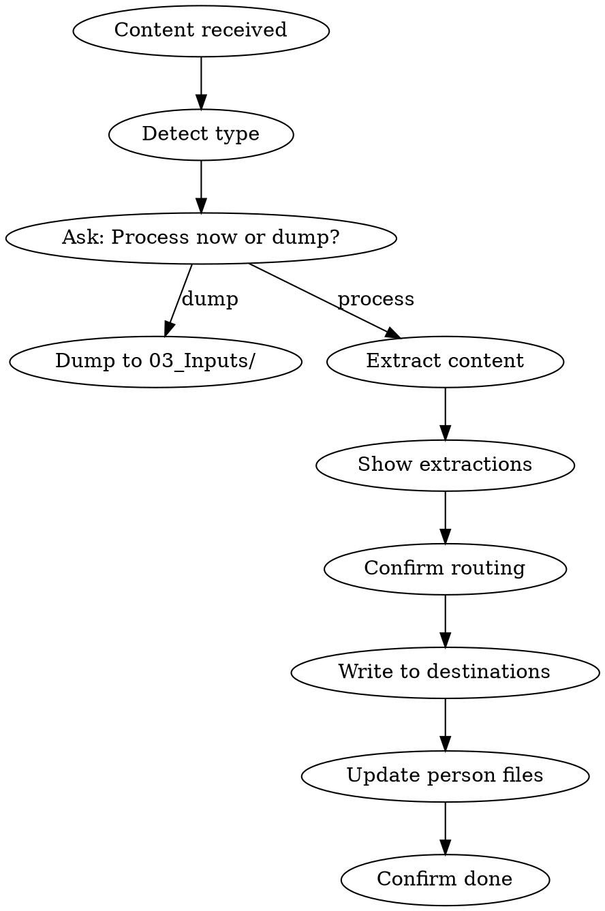

# alive:input

Digest external content immediately. Extract meaning, route to destination.

## Overview

Input handles content that comes FROM OUTSIDE — emails, transcripts, articles, Slack threads. Extract decisions, tasks, people, insights. Route to appropriate entity or dump to `03_Inputs/` for later triage.

**Different from:**
- `capture` — User's OWN thoughts from conversation ("FYI we decided X")
- `digest` — Process items already IN 03_Inputs/

**The test:** Did this content originate from the user in this conversation, or come from somewhere else?
- User types "We decided to use Stripe" → capture (their thought)
- User pastes "From: sarah@globex.com..." → input (external content)

## When to Trigger

**Explicit triggers:**
- Says "here's an email", "from my call with X", "got this from Slack"
- Asks to "digest this", "process this", "what should I do with this"

**Implicit triggers (ALSO valid):**
- Pastes multi-line external content without comment
- Shares content that clearly came from another source
- Forwards/quotes content from another person or system

**The rule:** If content came from OUTSIDE this conversation, trigger input. Don't wait for explicit instruction.

## Context Check (BEFORE Processing)

Load context to make intelligent routing decisions:

| Check | Why |
|-------|-----|
| Active entity (from `/alive:do`) | Default routing destination |
| `{entity}/_brain/manifest.json` | Know what areas exist (clients/, content/) |
| `{entity}/_brain/status.md` | Understand current focus, suggest relevance |
| `02_Life/people/` listing | Check for existing person files before creating |

```
▸ loading context...
  └─ Active: 04_Ventures/acme
  └─ Areas: clients/, content/, partnerships/
  └─ Focus: "Closing Q1 deals"
  └─ People: 47 files in 02_Life/people/
```

This context informs:
- **Routing suggestions** — "This looks like a client email → route to clients/?"
- **Area matching** — If manifest shows `clients/globex/` exists, route there
- **Person deduplication** — Check 02_Life/people/ before creating new person files
- **Relevance scoring** — Does this relate to current focus?

## Flow



## Step 1: Detect Content Type

| Type | Signals |
|------|---------|
| Email | "From:", "To:", "Subject:", forwarded markers |
| Transcript | Speaker labels, timestamps, dialogue format |
| Slack/Chat | @mentions, emoji reactions, thread format |
| Article | Long-form prose, headings, no dialogue |
| Document | Structured content, sections |
| Unknown | Ask user to clarify |

Show detection:
```
▸ detecting content type...
  └─ Email thread (3 messages)
```

## Step 2: Process Now or Dump?

Always ask:
```
I can:
[1] Process now — extract decisions, tasks, people, route to entity
[2] Dump to 03_Inputs/ — save for later triage with /alive:digest

Which?
```

If dump → save raw content to `03_Inputs/[date]-[type]-[subject].md` and exit.

## Step 3: Extract Content

Run appropriate extraction based on type:

### Email Extraction
- **People:** Names + roles from signatures, mentions
- **Decisions:** Agreements, confirmations, "we'll do X"
- **Tasks:** Action items, commitments, deadlines
- **Context:** Key info worth preserving

### Transcript Extraction
- **People:** All speakers + their positions/roles
- **Decisions:** Agreements made, conclusions reached
- **Tasks:** Assigned work, follow-ups mentioned
- **Insights:** Key learnings, revelations
- **Topics:** Main subjects discussed

### Article Extraction
- **Summary:** 2-3 sentence overview
- **Key points:** Bullet list of main ideas
- **Relevance:** Why this matters to user's entities

## Step 4: Show Extractions

Present what was found:
```
▸ extracted from email thread

PEOPLE
- Sarah Chen (CEO, Globex) — new contact
- John (mentioned as "our CTO")

DECISIONS
- Moving forward with pilot program
- Starting Feb 15

TASKS
- [ ] Send contract by Friday
- [ ] Schedule kickoff call

CONTEXT
- Budget approved for $50k
- 3-month initial engagement

─────────────────────────────────────────────────────────────────────────
[1] Confirm and route    [2] Edit extractions    [3] Cancel
```

## Step 5: Determine Routing

**Use manifest to suggest specific areas:**

If entity is active AND manifest shows relevant area:
```
▸ checking manifest...
  └─ Found: clients/globex/ (matches "Globex" in email)

Route to: 04_Ventures/acme
- Tasks → _brain/tasks.md
- Decision → _brain/changelog.md
- Source file → clients/globex/
- People → 02_Life/people/ (with links)

[1] Confirm    [2] Different location    [3] Dump to 03_Inputs/
```

If entity is active but no matching area:
```
Route to: 04_Ventures/acme
- Tasks → _brain/tasks.md
- Decision → _brain/changelog.md
- People → 02_Life/people/ (with links)

No matching area for source file. Options:
[1] Create clients/globex/ area
[2] Save to _working/
[3] 03_Inputs/ only

[c] Confirm routing    [d] Different entity
```

If no active entity:
```
Where should this go?

▸ scanning entities...
  └─ 04_Ventures/acme — "Globex" mentioned in status.md
  └─ 04_Ventures/beta — no match

[1] 04_Ventures/acme (suggested)
[2] 04_Ventures/beta
[3] 03_Inputs/ (triage later)
[4] Other
```

## Step 6: Write to Destinations

### Tasks → tasks.md
```markdown
## To Do
- [ ] Send contract by Friday (from email 2026-01-30)
- [ ] Schedule kickoff call (from email 2026-01-30)
```

### Decisions → changelog.md
```markdown
## 2026-01-30 — Email Context

### Decisions
- **Globex pilot:** Moving forward with Feb 15 start. Budget $50k approved.

### Source
Email thread with Sarah Chen (Globex)
```

### People → 02_Life/people/

Check if person exists:
- If exists → update with new context
- If new → create file

New person file:
```markdown
# Sarah Chen

**Role:** CEO
**Company:** Globex
**Met:** 2026-01-30 (email)

---

## Context
- Discussing pilot program with acme
- Budget holder, approved $50k

## References
- 04_Ventures/acme (potential client)
```

## Step 7: Confirm Done

```
✓ Routed to 04_Ventures/acme

Written:
- 2 tasks → _brain/tasks.md
- 1 decision → _brain/changelog.md
- 1 person → 02_Life/people/sarah-chen.md (created)

Source saved to: 03_Inputs/2026-01-30-email-globex.md
```

## Quick Mode

For simple content, streamline:
```
User: "FYI got this from Sarah: 'Call moved to 3pm Tuesday'"

▸ quick input

Task: Call with Sarah — Tuesday 3pm
Route to: 04_Ventures/acme/_brain/tasks.md

[1] Confirm    [2] Expand    [3] Cancel
```

## Person File Updates

When content mentions known people:

1. Check `02_Life/people/` for existing file
2. If found → add context, update "Last contact"
3. If not found → offer to create

```
Sarah Chen mentioned in this email.
Found: 02_Life/people/sarah-chen.md

Update with this context?
[1] Yes, update    [2] Skip person update
```

## Edge Cases

### Ambiguous Type
```
Can't determine content type.

Is this:
[1] Email/message
[2] Meeting transcript
[3] Article/document
[4] Other notes
```

### No Clear Extractions
```
No clear decisions, tasks, or people found.

[1] Save to 03_Inputs/ as reference
[2] Let me try manual extraction
[3] Cancel
```

### Multiple Entities Could Apply
```
This content could relate to:
[1] 04_Ventures/acme (client discussion)
[2] 04_Ventures/beta (mentioned partnership)
[3] Both — split routing
[4] 03_Inputs/ (decide later)
```

## Source Preservation

Always save original to `03_Inputs/` even after routing:
- File: `03_Inputs/[date]-[type]-[brief-subject].md`
- Preserves raw content
- Can be archived after processing

## Common Mistakes

| Mistake | Why it's wrong | Do this instead |
|---------|----------------|-----------------|
| Just acknowledging pasted content | External content = input trigger | Detect type, ask process/dump |
| Using capture for forwarded content | Capture = your own notes, Input = external | If it came from outside, use input |
| Skipping context check | Can't route intelligently without it | Always check manifest + people first |
| Skipping person file check | Creates duplicates, loses connections | Check 02_Life/people/ before creating |
| Deciding for user when unclear | User owns routing decisions | Always offer options |
| Skipping confirmations "for speed" | Wrong routing wastes more time | Confirm before writing |
| Dumping without asking | User might want immediate processing | Always ask process vs dump |

## Red Flags — STOP and Follow the Flow

These thoughts mean you're about to skip steps:

- "User didn't explicitly ask to process this" → Implicit trigger is valid
- "This is simple, I'll just capture it" → External source = input, not capture
- "No manifest, can't route" → Use folder listing as fallback
- "User seems busy, skip confirmations" → Confirmations prevent mistakes
- "No clear extractions, just save it" → Still show options, let user decide
- "I'll create the person file later" → Person check is part of the flow

**All of these mean: Follow the flow. Don't skip steps.**

## Fallbacks

**No manifest.json:**
```
▸ no manifest found, scanning folders...
  └─ Found: clients/, content/, _working/
```
Use actual folder structure instead.

**No active entity:**
```
▸ no entity loaded
  └─ Scanning all entities for matches...
```
Scan status.md files across all entities for keyword matches.

**No 02_Life/people/ folder:**
```
▸ 02_Life/people/ not found
  └─ Offer to create with first person file
```

## Related Skills

- `/alive:capture` — Quick mid-session notes (YOUR thoughts)
- `/alive:digest` — Process items already IN 03_Inputs/
- `/alive:do` — Load entity context first

---

## UI Treatment

This skill uses **Tier 3: Utility** formatting.

**Visual elements:**
- Compact logo (4-line ASCII art header)
- Double-line border wrap (entire response)
- Version footer: `ALIVE v2.0` (right-aligned)

See `rules/ui-standards.md` for exact border characters, logo assets, and formatting specifications.
