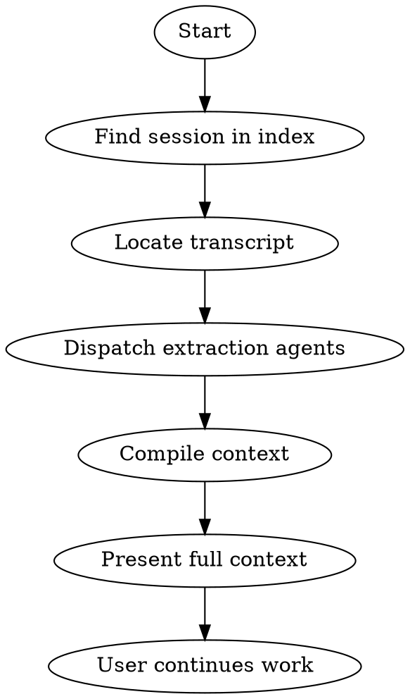

# alive:revive

Resume a past session with full context extraction from the raw transcript.

**Key principle:** Save stays fast. Revive does the heavy lifting by reading the actual session.

## UI Treatment

Uses the **ALIVE Shell** — Tier 3: Utility.

```
╭──────────────────────────────────────────────────────────╮
│  ALIVE · revive                         [session-id]      │
│  ──────────────────────────────────────────────────────── │
│  [Session context loaded + summary]                       │
│  ──────────────────────────────────────────────────────── │
│  [Ready to continue]                                      │
╰──────────────────────────────────────────────────────────╯
```

See `rules/ui-standards.md` for shell format, logo assets, and tier specifications.

---

## The Heavy Extraction

Revive reads the raw session transcript at `~/.claude/projects/.../{session_id}.jsonl` and dispatches agents to extract:
- Decisions with full rationale
- Key quotes (verbatim)
- Tasks identified
- Insights and learnings
- Where work left off
- What needs to happen next

**This is expensive but thorough.** The user gets full context to drop back in.

## Flow



## Step 1: Find Session

Search `.claude/state/session-index.jsonl`:

```
▸ searching session-index for "plugin rebuild"...
  └─ found: 241fb8e4 — Plugin rebuild v2 [breakthrough]

Is this the session?
[1] Yes, revive it
[2] Show more sessions
```

## Step 2: Locate Transcript

Find the raw session file:
```
▸ locating transcript...
  └─ ~/.claude/projects/-Users-{user}-{project}/241fb8e4.jsonl
  └─ Size: 2.1MB (~45k tokens)
```

## Step 3: Dispatch Extraction Agents

For long sessions, dispatch multiple agents in parallel to cover the full transcript:

```
▸ compiling context (this takes a moment)...
  └─ dispatching 3 agents over 45k token session
  └─ extracting decisions, quotes, tasks, insights...
```

**Agent prompt template:**
```
Read this section of session transcript.
Extract:
1. DECISIONS — What was decided and why (verbatim rationale)
2. KEY QUOTES — Important statements worth preserving exactly
3. TASKS — Action items identified
4. INSIGHTS — Domain knowledge (strategy, product, process, market)
   For technical patterns, offer auto-memory rather than insights.md
5. CONTINUATION — Where work left off, what's next

Be thorough. Include verbatim quotes. This is for full context restoration.
```

**Parallelization:**
- Sessions < 20k tokens: 1 agent
- Sessions 20-50k tokens: 2-3 agents (split by section)
- Sessions > 50k tokens: 4+ agents

## Step 4: Compile and Present

Merge agent outputs into comprehensive context:

```
╭─ ALIVE ────────────────────────────────────────────────────────────────╮
│  revive • 241fb8e4                                                     │
╰────────────────────────────────────────────────────────────────────────╯

SESSION: Plugin rebuild v2
DATE: 2026-01-30
VENTURE: 04_Ventures/acme-agency
QUALITY: Breakthrough

━━━━━━━━━━━━━━━━━━━━━━━━━━━━━━━━━━━━━━━━━━━━━━━━━━━━━━━━━━━━━━━━━━━━━━━━━

DECISIONS (with rationale)
━━━━━━━━━━━━━━━━━━━━━━━━━━━━━━━━━━━━━━━━━━━━━━━━━━━━━━━━━━━━━━━━━━━━━━━━━
1. **inbox/ → 03_Inputs/**
   Rationale: "You're only as good as your inputs — reframes from
   passive receiving to active feeding"

2. **_state/ → _brain/**
   Rationale: "Brain analogy — the project's working memory, not just
   state storage"

3. **Save fast, revive heavy**
   Rationale: "If saving takes 5 minutes, no one saves. Heavy extraction
   happens on resume."

4. **4-tier quality scale**
   Rationale: "Numerical ratings are subjective. Breakthrough vs routine
   is objective."

KEY QUOTES (verbatim)
━━━━━━━━━━━━━━━━━━━━━━━━━━━━━━━━━━━━━━━━━━━━━━━━━━━━━━━━━━━━━━━━━━━━━━━━━
> "The 3-2-1 flow is the core innovation — fast saves with smart
   escalation"

> "VERIFY BEFORE CONFIRMING. Save is the chance to complete the loop."

> "Every file needs a manifest entry with description. No exceptions."

> "SessionEnd hooks are unreliable — design around explicit saves"

TASKS IDENTIFIED
━━━━━━━━━━━━━━━━━━━━━━━━━━━━━━━━━━━━━━━━━━━━━━━━━━━━━━━━━━━━━━━━━━━━━━━━━
Completed:
- [x] Build daily skill
- [x] Build save skill with Will's feedback
- [x] Build capture-context skill

Remaining:
- [ ] Polish do skill @urgent
- [ ] Build onboarding skill (P2)
- [ ] Build upgrade skill (P2)

INSIGHTS
━━━━━━━━━━━━━━━━━━━━━━━━━━━━━━━━━━━━━━━━━━━━━━━━━━━━━━━━━━━━━━━━━━━━━━━━━
• Quality-based escalation prevents save fatigue
• AskUserQuestion makes 3 questions feel fast
• Manifest is a semantic sitemap, not just a file list
• Closest unit rule prevents saving to wrong level

WHERE YOU LEFT OFF
━━━━━━━━━━━━━━━━━━━━━━━━━━━━━━━━━━━━━━━━━━━━━━━━━━━━━━━━━━━━━━━━━━━━━━━━━
Phase 1 (learning loop) skills complete. Moving to Phase 2.
User said "Pre-compact" — context was running low.
Thread marked "Ongoing" — will be back.

WHAT'S NEXT
━━━━━━━━━━━━━━━━━━━━━━━━━━━━━━━━━━━━━━━━━━━━━━━━━━━━━━━━━━━━━━━━━━━━━━━━━
1. Polish do skill (minor terminology updates)
2. Build onboarding skill
3. Build upgrade skill

─────────────────────────────────────────────────────────────────────────
You're fully caught up. What's first?

[1] Polish do skill
[2] Build onboarding
[3] Build upgrade
```

## Edge Cases

**Transcript not found:**
```
[!] Session transcript not found at expected path.

The session 241fb8e4 is in the index but the transcript
file is missing. It may have been cleaned up.

Fallback: Loading from _brain/ files only (limited context).
```

**Very long session (100k+ tokens):**
```
▸ large session detected (120k tokens)
  └─ dispatching 6 extraction agents
  └─ this may take 30-60 seconds...
```

**Session from different machine:**
```
[!] Session transcript is on a different machine.

The session was recorded on machine-a but you're on machine-b.
Can only load from _brain/ files (no full extraction).
```

## What Gets Extracted

| Element | Source | Verbatim? |
|---------|--------|-----------|
| Decisions | Transcript | Yes — include rationale |
| Key quotes | Transcript | Yes — exact words |
| Tasks | Transcript + tasks.md | Merged |
| Insights (domain knowledge) | Transcript | Yes — preserve phrasing |
| Continuation point | End of transcript | Summary |
| What's next | User's stated intentions | Yes |

## Related Skills

- `/alive:daily` — Shows threads, picks one → calls revive
- `/alive:work` — Fresh start on unit (no extraction)
- `/alive:save` — End session, log to index

