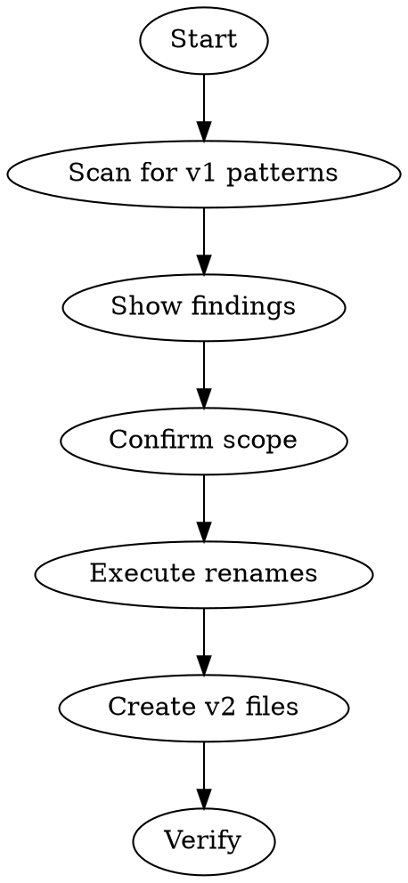

# alive:upgrade

Migrate an ALIVE system from v1 to v2 structure.

## v1 → v2 Changes

| v1 | v2 |
|----|-----|
| `inbox/` | `inputs/` |
| `_state/` | `_brain/` |
| No session-index | `.claude/state/session-index.jsonl` |
| No memories folder | `{entity}/_brain/memories/` (created on breakthrough saves) |

## Flow



## Step 1: Scan for v1 Patterns

Find all v1 artifacts, categorized:

```
▸ scanning for v1 patterns...

ROOT INBOX (v1):
  └─ inbox/ (should be inputs/)

ENTITY _STATE/ FOLDERS (v1):
  └─ ventures/acme/_state/
  └─ ventures/beta/_state/
  └─ life/finance/_state/

NESTED inbox/ FOLDERS:
  └─ ventures/acme/clients/foo/inbox/
  └─ ventures/hypha/inbox/

SKIP — TEMPLATES:
  └─ _working/template/*/_state/

SKIP — ARCHIVE:
  └─ archive/*/_state/

V2 FILES STATUS:
  └─ .claude/state/session-index.jsonl [missing/exists]

RULES STATUS:
  └─ .claude/rules/ [missing/exists]
  └─ If exists: [X files, Y outdated, Z missing]

ENTITY MEMORIES FOLDERS:
  └─ ventures/acme/_brain/memories/ [missing/exists]
  └─ ventures/beta/_brain/memories/ [missing/exists]
  (memories/ created automatically on breakthrough saves, missing is OK)
```

## Step 2: Confirm Scope

**Always ask before proceeding:**

```
Found 3 entities with _state/ folders and inbox/ directory.

What should be upgraded?
[1] Everything (recommended)
[2] Let me pick individually
[3] Cancel
```

**Handle special cases explicitly:**

| Case | Ask |
|------|-----|
| Template directories | "Found _state/ in templates. Skip templates?" |
| Archive | "Found _state/ in archive/. Upgrade archived items too?" |
| Nested entities | "Found _state/ at client level. Treat as entities?" |

**Default recommendations:**
- Templates → Skip (preserve as v1 templates)
- Archive → Skip (preserve history)
- Nested `_state/` → Ask (could be intentional entities)
- Nested `inbox/` → Rename to `inputs/` (client-level inputs are valid)

## Step 3: Execute Renames

**Order matters:**

1. Rename `inbox/` → `inputs/`
2. Rename each `_state/` → `_brain/`

Show progress:
```
▸ renaming inbox/ → inputs/
  ✓ done (3 files preserved)

▸ renaming ventures/acme/_state/ → _brain/
  ✓ done

▸ renaming ventures/beta/_state/ → _brain/
  ✓ done
```

## Step 4: Create/Update v2 Files

### 4a: System Files (If Missing)

```
▸ checking v2 system files...

.claude/state/session-index.jsonl
  └─ [exists] skipping
  └─ OR [missing] creating empty file
```

**session-index.jsonl format** (if creating):
```jsonl
{"created":"2026-01-30","note":"Migrated from v1"}
```

### 4b: Sync Rules (CRITICAL)

**Compare user's rules to plugin's rules and sync if different:**

```
▸ checking rules...

Plugin rules: ~/.claude/plugins/cache/aliveskills/alive/{version}/rules/
User rules:   {alive-root}/.claude/rules/
```

**If user has no rules directory:**
```
[!] No rules installed

ALIVE rules enforce system behaviour. Without them, Claude won't follow
ALIVE conventions.

Install rules now?
[1] Yes, install rules (recommended)
[2] Skip (system will be unreliable)
```

**If rules exist but are outdated:**
```
▸ comparing rules...

OUTDATED:
  └─ behaviors.md (plugin: 2026-02-01, yours: 2026-01-15)
  └─ conventions.md (plugin: 2026-02-01, yours: 2026-01-15)

MISSING:
  └─ working-folder-evolution.md (new in this version)

UP TO DATE:
  └─ intent.md
  └─ voice.md

Sync rules to latest?
[1] Yes, update all (recommended)
[2] Update only outdated
[3] Skip
```

**Implementation:**
```bash
# Compare checksums
for file in ~/.claude/plugins/cache/aliveskills/alive/*/rules/*.md; do
  filename=$(basename "$file")
  user_file="{alive-root}/.claude/rules/$filename"
  if [ ! -f "$user_file" ]; then
    echo "MISSING: $filename"
  elif ! diff -q "$file" "$user_file" > /dev/null 2>&1; then
    echo "OUTDATED: $filename"
  fi
done
```

**After sync:**
```
▸ syncing rules...
  └─ behaviors.md ✓
  └─ conventions.md ✓
  └─ working-folder-evolution.md ✓ (new)

✓ Rules synced (3 files updated)
```

### 4c: Sync Statusline (If Configured)

**Check if user has statusline configured, and if so, update it:**

```
▸ checking statusline...

~/.claude/statusline-command.sh
  └─ [not found] skipping (user hasn't configured statusline)
  └─ OR [outdated] plugin version is newer
  └─ OR [up to date] no action needed
```

**If statusline exists but is outdated:**
```
[!] Statusline script outdated

Your statusline was installed on 2026-01-28.
Plugin has newer version with fixes for:
  • inputs/ path detection (was inbox/)
  • ALIVE root indicator
  • Smart path detection

Update statusline?
[1] Yes, update (recommended)
[2] No, keep current
```

**Implementation:**
```bash
# Compare statusline if it exists
user_statusline="$HOME/.claude/statusline-command.sh"
plugin_statusline="$HOME/.claude/plugins/cache/aliveskills/alive/*/templates/config/statusline-command.sh"

if [ -f "$user_statusline" ]; then
  if ! diff -q $plugin_statusline "$user_statusline" > /dev/null 2>&1; then
    echo "OUTDATED: statusline-command.sh"
  fi
fi
```

**After sync:**
```
▸ updating statusline...
  └─ ~/.claude/statusline-command.sh ✓

✓ Statusline updated
```

**Note on memories/:** The `_brain/memories/` folder is created automatically by `/alive:save` when a session is marked as a breakthrough. Don't create it during upgrade — it appears organically when needed.

## Step 5: Verify

```
▸ verifying migration...

STRUCTURE
  ✓ No inbox/ found (now inputs/)
  ✓ No _state/ found in upgraded entities
  ✓ session-index.jsonl exists
  ✓ All _brain/ folders have required files

RULES
  ✓ .claude/rules/ exists
  ✓ All 7 rule files present and up to date

STATUSLINE (if configured)
  ✓ ~/.claude/statusline-command.sh up to date
  └─ OR [skipped] not configured

Migration complete.
```

**If verification fails, do NOT mark complete:**
```
✗ VERIFICATION FAILED

Missing:
  ✗ .claude/rules/ — rules not synced

[1] Fix now
[2] Cancel upgrade
```

## Edge Cases

**Single entity upgrade (from /alive:do):**

When called from `do` with a specific entity:
```
Upgrading ventures/acme only.

[1] Upgrade this entity
[2] Upgrade entire system
[3] Cancel
```

**Already v2:**
```
✓ System is already v2 structure.
  └─ inputs/ exists
  └─ All entities use _brain/

Nothing to upgrade.
```

**Mixed state:**
```
[!] Partial v2 detected

Already v2:
  └─ ventures/acme/_brain/

Still v1:
  └─ ventures/beta/_state/
  └─ inbox/

Upgrade remaining v1 items?
```

## Step 6: Update References (Optional)

After renames, offer to update documentation:

```
[!] Found references to v1 paths in:
  └─ .claude/CLAUDE.md (12 mentions of _state/)
  └─ .claude/rules/navigation.md (5 mentions)
  └─ .claude/rules/state-files.md (8 mentions)

Update these to v2 paths?
[1] Yes, update all
[2] No, I'll do it manually
```

If yes, replace:
- `_state/` → `_brain/`
- `inbox/` → `inputs/`
- `subdomain` → `entity` (terminology)

## After Upgrade

```
✓ Migration complete.

Summary:
• Renamed inbox/ → inputs/
• Renamed X entities from _state/ → _brain/
• Created/verified v2 system files
• [Updated/Skipped] documentation references

Next: Run /alive:daily to see your v2 dashboard.
```

## Related Skills

- `/alive:daily` — Detects v1, calls this skill
- `/alive:do` — Detects v1, calls this skill
- `/alive:onboarding` — Fresh v2 setup (no migration)
