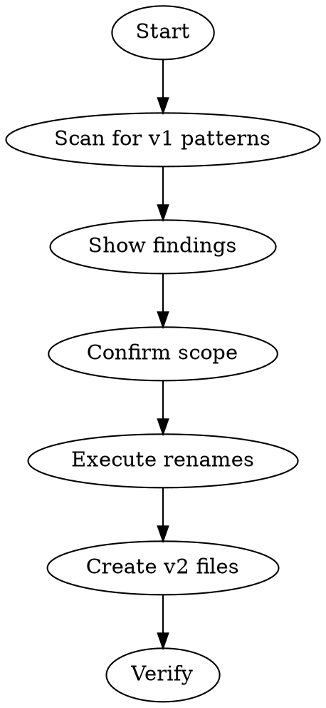

# alive:upgrade

Migrate an ALIVE system from v1 to v2 structure.

## v1 → v2 Changes

| v1 | v2 |
|----|-----|
| `inbox/` | `inputs/` |
| `_state/` | `_brain/` |
| No session-index | `.claude/state/session-index.jsonl` |
| No verbatim | `.claude/state/verbatim/` |

## Flow



## Step 1: Scan for v1 Patterns

Find all v1 artifacts, categorized:

```
▸ scanning for v1 patterns...

ROOT INBOX (v1):
  └─ inbox/ (should be inputs/)

ENTITY _STATE/ FOLDERS (v1):
  └─ ventures/acme/_state/
  └─ ventures/beta/_state/
  └─ life/finance/_state/

NESTED inbox/ FOLDERS:
  └─ ventures/acme/clients/foo/inbox/
  └─ ventures/hypha/inbox/

SKIP — TEMPLATES:
  └─ _working/template/*/_state/

SKIP — ARCHIVE:
  └─ archive/*/_state/

V2 FILES STATUS:
  └─ .claude/state/session-index.jsonl [missing/exists]
  └─ .claude/state/verbatim/ [missing/exists]
```

## Step 2: Confirm Scope

**Always ask before proceeding:**

```
Found 3 entities with _state/ folders and inbox/ directory.

What should be upgraded?
[1] Everything (recommended)
[2] Let me pick individually
[3] Cancel
```

**Handle special cases explicitly:**

| Case | Ask |
|------|-----|
| Template directories | "Found _state/ in templates. Skip templates?" |
| Archive | "Found _state/ in archive/. Upgrade archived items too?" |
| Nested entities | "Found _state/ at client level. Treat as entities?" |

**Default recommendations:**
- Templates → Skip (preserve as v1 templates)
- Archive → Skip (preserve history)
- Nested `_state/` → Ask (could be intentional entities)
- Nested `inbox/` → Rename to `inputs/` (client-level inputs are valid)

## Step 3: Execute Renames

**Order matters:**

1. Rename `inbox/` → `inputs/`
2. Rename each `_state/` → `_brain/`

Show progress:
```
▸ renaming inbox/ → inputs/
  ✓ done (3 files preserved)

▸ renaming ventures/acme/_state/ → _brain/
  ✓ done

▸ renaming ventures/beta/_state/ → _brain/
  ✓ done
```

## Step 4: Create v2 Files (If Missing)

Check first, only create if missing:

```
▸ checking v2 files...

.claude/state/session-index.jsonl
  └─ [exists] skipping
  └─ OR [missing] creating empty file

.claude/state/verbatim/
  └─ [exists] skipping
  └─ OR [missing] creating directory
```

**session-index.jsonl format** (if creating):
```jsonl
{"created":"2026-01-30","note":"Migrated from v1"}
```

**verbatim/** is just an empty directory for future breakthrough saves.

## Step 5: Verify

```
▸ verifying migration...

✓ No inbox/ found (now inputs/)
✓ No _state/ found in upgraded entities
✓ session-index.jsonl exists
✓ verbatim/ directory exists

Migration complete.
```

## Edge Cases

**Single entity upgrade (from /alive:do):**

When called from `do` with a specific entity:
```
Upgrading ventures/acme only.

[1] Upgrade this entity
[2] Upgrade entire system
[3] Cancel
```

**Already v2:**
```
✓ System is already v2 structure.
  └─ inputs/ exists
  └─ All entities use _brain/

Nothing to upgrade.
```

**Mixed state:**
```
[!] Partial v2 detected

Already v2:
  └─ ventures/acme/_brain/

Still v1:
  └─ ventures/beta/_state/
  └─ inbox/

Upgrade remaining v1 items?
```

## Step 6: Update References (Optional)

After renames, offer to update documentation:

```
[!] Found references to v1 paths in:
  └─ .claude/CLAUDE.md (12 mentions of _state/)
  └─ .claude/rules/navigation.md (5 mentions)
  └─ .claude/rules/state-files.md (8 mentions)

Update these to v2 paths?
[1] Yes, update all
[2] No, I'll do it manually
```

If yes, replace:
- `_state/` → `_brain/`
- `inbox/` → `inputs/`
- `subdomain` → `entity` (terminology)

## After Upgrade

```
✓ Migration complete.

Summary:
• Renamed inbox/ → inputs/
• Renamed X entities from _state/ → _brain/
• Created/verified v2 system files
• [Updated/Skipped] documentation references

Next: Run /alive:daily to see your v2 dashboard.
```

## Related Skills

- `/alive:daily` — Detects v1, calls this skill
- `/alive:do` — Detects v1, calls this skill
- `/alive:onboarding` — Fresh v2 setup (no migration)
