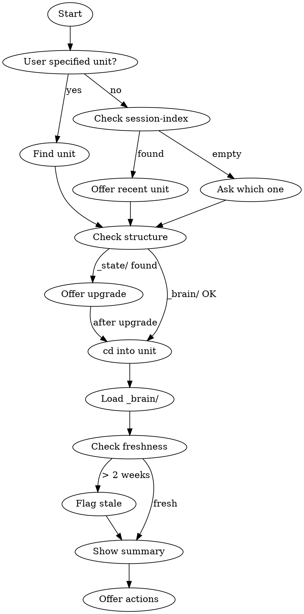

# alive:work

Focus on ONE venture, experiment, life area, or project. Load context from its `_brain/` folder and show current state.

**Different from `/alive:daily`:** Work focuses on ONE unit. Daily shows EVERYTHING.

## UI Treatment

Uses the **ALIVE Shell** — one rounded box, three zones.

```
╭──────────────────────────────────────────────────────────╮
│  ALIVE · work                            [date]          │
│  [unit-name]                                             │
│  ──────────────────────────────────────────────────────  │
│  [Goal + current focus]                                  │
│  [! urgent items]                                        │
│  [tasks list]                                            │
│  ──────────────────────────────────────────────────────  │
│  [ACTIONS]                                               │
│  [FINE PRINT — aggregate stats]                          │
╰──────────────────────────────────────────────────────────╯
```

See `rules/ui-standards.md` for shell format, logo assets, and tier specifications.

## Version Check (Before Main Flow)

Compare your `plugin_version` (from frontmatter above) against the user's system:

1. Read `{alive-root}/.claude/alive.local.yaml` → get `system_version`
2. If `system_version` is missing or different from your `plugin_version`:
   ```
   [!] System update available (plugin: 3.0.1, system: X.X.X)
       └─ Run /alive:upgrade to sync
   ```
3. Continue with skill — this is non-blocking, just a notice

---

## Flow



## Step 1: Identify Unit

**User specifies unit:**
```
"work on acme" → 04_Ventures/acme/
"focus on health" → 02_Life/health/
```

**User says "continue" or "resume" (no unit specified):**
1. Read `.claude/state/session-index.jsonl`
2. Find most recent `status: "ongoing"` entry
3. Offer that:
```
▸ checking session-index...
  └─ Last session: 04_Ventures/alive-llc (yesterday, [breakthrough])

Continue with alive-llc?
[1] Yes
[2] Pick different one
```

**No session-index or no ongoing threads:**
```
No recent session found.

Which one?
[1] 04_Ventures/acme-agency
[2] 04_Ventures/side-project
[3] 05_Experiments/new-idea
```

**Multiple matches:**
```
"work on beta" matches:
[1] 04_Ventures/beta
[2] 05_Experiments/beta-test

Which one?
```

## Step 2: Check Structure (v1 Detection)

Before loading, check if unit uses v1 structure:

```
Check: Does {unit}/_state/ exist? (should be _brain/)
```

If v1 detected:
```
[!] 04_Ventures/acme uses v1 structure (_state/)

Upgrade to v2?
[1] Yes, upgrade now
[2] No, continue with v1
```

If yes → invoke `/alive:upgrade` with this unit, then continue.
If no → use `_state/` paths for this session.

## Step 2.5: Change to Unit Directory (MANDATORY)

**Before loading context, `cd` into the unit directory:**

```bash
cd {alive-root}/{unit}/
```

For example:
```bash
cd ~/Desktop/alive/04_Ventures/acme-agency/
```

**Why this matters:**
- Claude's system context automatically reads `.claude/CLAUDE.md` from the working directory
- Local `CLAUDE.md` files get picked up
- All relative paths in the session work correctly
- The unit becomes the "home base" for the session

**Show the change:**
```
▸ cd 04_Ventures/acme-agency/
  └─ Working directory set
```

## Step 3: Load Context (MANDATORY — All 4 Files)

**You MUST read all 4 files. Do not skip any.**

Read in order:
1. `{unit}/_brain/status.md` — Phase and focus
2. `{unit}/_brain/tasks.md` — Work queue
3. `{unit}/_brain/manifest.json` — Structure map
4. `{unit}/_brain/changelog.md` — **First 200 lines** (recent session history)

**The changelog is CRITICAL.** It contains:
- What happened in recent sessions
- Decisions made and why
- Context that won't be in status.md
- Where we left off last time

**Why first 200 lines?** The save skill **prepends** new entries (most recent first). So the top of the file has the newest sessions.

**Show retrieval paths:**
```
▸ reading 04_Ventures/acme/_brain/status.md
  └─ Phase: Building (updated 2 days ago)

▸ reading 04_Ventures/acme/_brain/tasks.md
  └─ 7 tasks, 2 @urgent

▸ reading 04_Ventures/acme/_brain/manifest.json
  └─ 12 files tracked, 3 references

▸ reading 04_Ventures/acme/_brain/changelog.md (first 200 lines)
  └─ Last session: 2026-02-04 — Plugin UI updates
```

**Implementation:**
```
Read(file_path: "{unit}/_brain/changelog.md", limit: 200)
```

**References:** If the manifest has a `references` array, mention the count to the user (e.g. "3 reference docs available"). Don't load the files — just surface awareness. Users can ask to read specific references on demand.

## Step 4: Check Freshness

Check `updated` date in manifest.json or file timestamps:

| Age | Action |
|-----|--------|
| < 2 weeks | Proceed normally |
| 2-4 weeks | Flag: `[!] Status is X days old. Still accurate?` |
| > 4 weeks | Warn + ask: `[!!] Status is very stale. Update before working?` |

```
[!] 04_Ventures/acme/_brain/status.md is 3 weeks old
    └─ Still accurate? [y] continue  [u] update first
```

## Step 5: Show Summary

**Always show the full summary — status, tasks, and any pending handoffs.**

Handoffs are part of the overview, not a blocking gate. But they should be **prominent** — a pending handoff means a previous session left unfinished work, and the user should know about it.

### Check manifest.handoffs[]

After loading `manifest.json` in Step 3, check the `handoffs` array:

```json
{
  "handoffs": [
    {
      "session_id": "abc12345",
      "date": "2026-02-02",
      "reason": "pre-compact",
      "thread": "ongoing",
      "file": "_working/sessions/plugin-feedback-abc12345-2026-02-02.md",
      "summary": "Brief description of what was in progress"
    }
  ]
}
```

Each entry represents an unfinished session with context that would otherwise be lost.

### Summary Display

```
╭──────────────────────────────────────────────────────────╮
│                                                          │
│  ALIVE · work                            2026-02-09      │
│  acme-agency                                             │
│                                                          │
│  ──────────────────────────────────────────────────────  │
│                                                          │
│  Ship client portal by end of month                      │
│  Focus: Landing page launch by Friday                    │
│                                                          │
│  ! Finalize pricing page                         Feb 12  │
│                                                          │
│                                                          │
│  tasks                                                   │
│     ~  Build pricing page layout                         │
│     ~  Fix payment webhook integration                   │
│        Write launch email                                │
│        Update documentation                              │
│        Set up analytics tracking                         │
│     ✓  Hero section design                       Feb 07  │
│     ✓  Database schema migration                 Feb 06  │
│                                                          │
│  ──────────────────────────────────────────────────────  │
│                                                          │
│  1) continue current task  +) add a new task             │
│  s) save and exit session  w) open a working file        │
│                                                          │
│  7 total · 2 done · 3 working files · last: yesterday    │
│                                                          │
╰──────────────────────────────────────────────────────────╯
```

**Key details:**
- Show the `[!]` flag to draw attention
- Include the `summary` from each handoff entry so the user knows what's in each one
- Show the `reason` (context compact, resuming later) and `date`
- Handoffs appear BEFORE tasks — they represent prior work that may be more relevant than the task list

**If no handoffs:** Omit the HANDOFFS section entirely. Don't show "0 handoffs".

**If only handoffs, no tasks:** Show handoffs and note "No tasks in queue."

**If handoffs exist, nudge the user:**
```
[!] You have 2 pending handoffs from previous sessions.
    These contain context that would otherwise be lost.
    Pick [r1] or [r2] to resume, or choose a task to start fresh.
```

## Step 6: Offer Actions

Every actionable item gets a number. Handoffs appear alongside tasks:

Tasks and handoffs appear in the main content zone (see Summary Display above). Handoffs are surfaced inline:

```
│  [!] Handoff from Feb 2 — Landing page wireframes        │
│      r) resume this session                              │
```

**If no handoffs:** Omit the handoff section.

## Resuming a Handoff

When the user picks a handoff (e.g. `r1` or "resume the plugin feedback session"):

1. **Read the handoff document** into memory
2. **Archive immediately** — move file to `01_Archive/{unit-path}/sessions/` and remove from `manifest.handoffs[]`:
   ```
   ▸ loading handoff...
     └─ Reading _working/sessions/plugin-feedback-abc12345-2026-02-02.md

   ▸ archiving handoff (already read)...
     └─ Moving to 01_Archive/{unit-path}/sessions/
     └─ Removing from manifest.handoffs[]

   ✓ Handoff archived — context loaded
   ```
3. **Present the context** from the handoff — current state, decisions, and next steps
4. Continue working from where the handoff left off

**Why archive immediately?** The handoff's job is done once read. "Archive later" gets forgotten 100% of the time. Archive on read = 100% adherence.

**If user picks a task instead of a handoff:** Proceed normally. Handoffs stay in manifest until explicitly resumed or cleaned up by `/alive:sweep`.

## Edge Cases

**Unit doesn't exist:**
```
✗ 04_Ventures/acme/ not found

[1] Create 04_Ventures/acme/ (→ /alive:new)
[2] Show available ventures and experiments
```

**No _brain/ or _state/ folder:**
```
[!] 04_Ventures/acme/ exists but has no context folder

Initialize _brain/ now?
[1] Yes, initialize
[2] Cancel
```

## After Loading

- Stay scoped to this unit (don't read other units)
- Track changes for session
- When done → `/alive:save`

## Related Skills

- `/alive:daily` — See ALL ventures and experiments
- `/alive:save` — End session
- `/alive:new` — Create venture, experiment, life area, or project
- `/alive:upgrade` — Migrate v1 → v2
- `/alive:handoff` — Session continuity (creates handoff docs for resumption)
